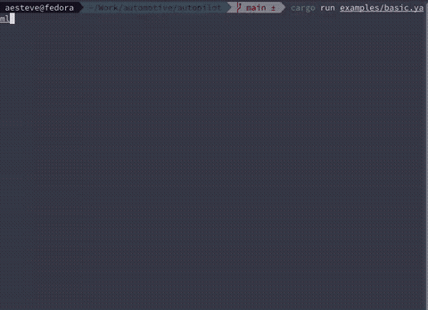

<!--
SPDX-FileCopyrightText: 2025 Albert Esteve <aesteve@redhat.com>

SPDX-License-Identifier: GPL-3.0-or-later
-->

# AutoPilot

Automate workflows with ease - messages, commands, loops, remote execution,
and styled terminal output.


# Features
- Sequential task execution
- Styled messages with colors, styles, and configurable speed
- Command execution with local or remote (SSH) support
- Loops with configurable delay
- Hide command output for silent execution
- YAML-based, human-friendly configuration
- Beautiful display in a terminal user interface (TUI)

# Installation

```terminal
git clone https://github.com/aesteve-rh/autopilot.git
cd autopilot
cargo build --release
```

# Usage

- Create a YAML file like this:

```yaml
stages:
  - name: "Deploy App"
    actions:
      - type: message
        text: "Starting Deployment..."
        style:
          color: cyan
          bold: true
        speed: 50

      - type: command
        command: "echo 'Deploying services...'"
        hide_output: false

      - type: command
        command:
          - restart-service.sh
          - echo 'Service restarted'
        remote:
          user: user
          host: server.com
          port: 22
        loop:
          times: 3
          delay: 2000
```

**NOTE:** You can see all configuration options documented at [docs/config.md](docs/config.md).

- Run It

```console
autopilot my_tasks.yaml
```

# Output



# Inspiration

This project has been heavily inspired by [nohands](https://github.com/nirs/nohands).

Its purpose and behaviour is similar. But `autopilot` supports more features and
includes a modern user interface to show the demos.

# Contribute

PRs welcome! Feel free to open issues for new features.
